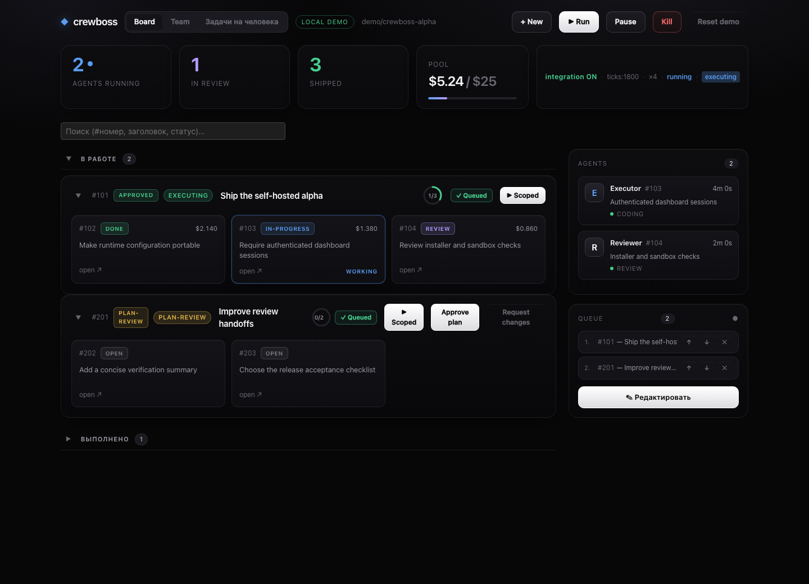
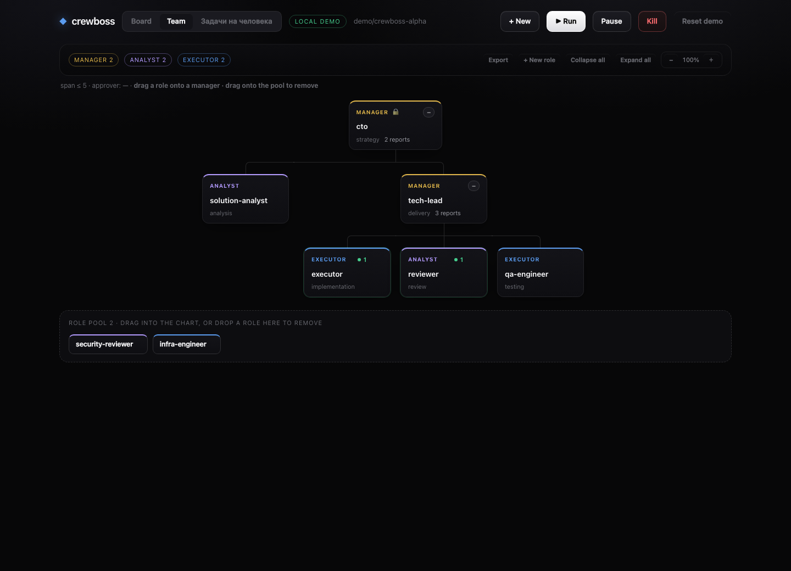

# Try the local demo

The demo runs the dashboard with sample data in your browser. It needs no GitHub
account, API token, Python API, sandbox, or Claude installation. Commands and
edits affect only the current tab's sample data. No agent sessions run and no
provider usage is incurred.

From the repository root:

```sh
make setup
make demo
```

Open the local URL printed by Vite. The header shows **Local demo**. Try pausing
the loop, opening a queued charter, switching to the Team view, or creating a
sample issue. **Reset demo** restores the sample dataset; a page reload also
clears changes. The fixture adapter handles every dashboard request locally and
never forwards unknown actions to a real API.

`make demo` sets `VITE_CREWBOSS_DEMO=1` for the Vite server. Stop it with Ctrl+C.
Start `npm run dev --prefix ui/app` without that flag to use a real API. In live
mode, enter the API URL and bearer token in Connection settings; the token lasts
only until that page is reloaded.

## Preview





## Verify the demo

Unit tests cover local reads, commands, queue and team edits, resets, and blocked
network fallback. The browser check starts and stops its own demo server and
verifies the main views, pause/reset, task details, and the absence of API calls
or stored credentials:

```sh
cd ui/app
npx playwright install chromium
node scripts/demo-smoke.mjs
```

The browser check refreshes the screenshots above. Set
`CB_DEMO_SCREENSHOT_DIR=/absolute/output/directory` to write temporary screenshots
instead. The browser download is only needed for this check, not for using the
demo.
