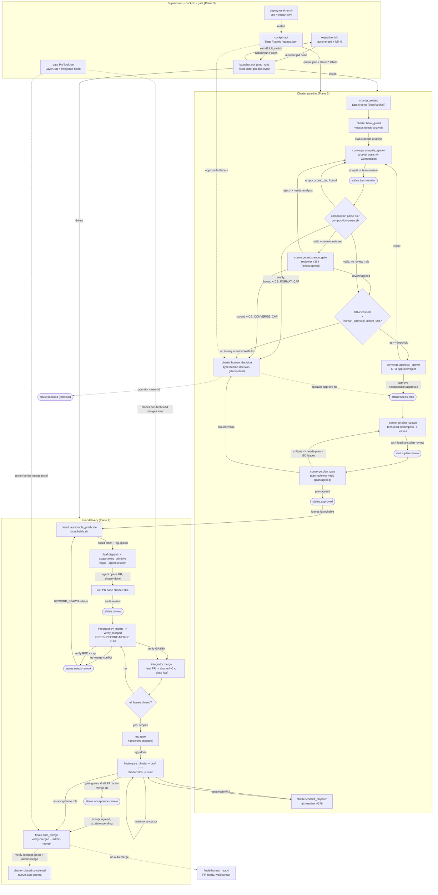
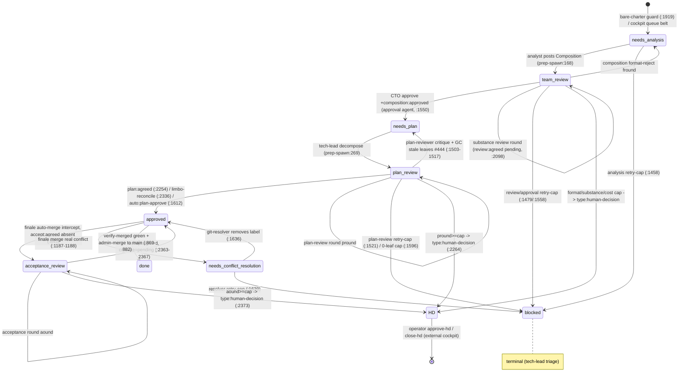

# crewboss — end-to-end loop process map

> Graph-ready synthesis of 11 verified subsystem maps. Every edge is grounded in a
> `file:line` or an exact label/condition drawn from the runtime at
> `reference/runtime/crewboss-launcher-gh.sh` and siblings. Inferred edges are marked.
> Line numbers refer to `crewboss-launcher-gh.sh` unless another file is named.

## 0. Overview

crewboss is a self-hosting autonomous software-delivery loop that runs in **three planes**
over a **five-layer stack**. **Plane 1 — charter pipeline**: a `type:charter` GitHub issue is
authored by a boss and advanced through a `status:*` label state machine
(needs-analysis → team-review → needs-plan → plan-review → approved) by AI *manager/pipeline*
roles (analyst, composition-reviewer, CTO-approval, tech-lead, plan-reviewer,
acceptance-reviewer, git-resolver), each stage capped by an idempotent `type:human-decision`
escalation. **Plane 2 — leaf delivery**: once a charter is `status:approved`, the tech-lead's
decomposition into `type:agent` *leaf* issues is executed by jailed `--agent` sessions
(executor/reviewer/qa/infra/security) that open PRs based on `charter/<C>`; an integrator
verify-merges each green leaf into the charter branch, a test-quality gate runs, and a
charter-finale gate-merges `charter/<C> → main` and closes the charter. **Plane 3 —
supervision + cockpit + gate**: a `launcher.pid`-guarded launcher loop drives everything on an
EC2 box; a keepalive timer restarts it if dead; a stdlib HTTP/SSE cockpit
(`crewboss-api.py`) lets a human read the board and steer via flag-files, labels and
`queue.json`; and a central PreToolUse **gate** (`crewboss-gate.sh`) enforces reliability
invariants (who may author/merge/close, green-before-merge, completion proof-contracts).
The layers are: **config** (`org.json`/`roles/*.md`/`rubric.json` desired-state team tree) →
**launcher tick** (dispatch + completion routing) → **spawn adapters** (prep + prep-spawn) →
**spawn primitive** (`crewboss-spawn.sh`: budget, proxy, nsjail, seccomp) → **board**
(`board-gh.sh` + GitHub issue labels = the state storage).

---

## 1. Master flow (Mermaid)

---

## 2. Charter status state machine (Mermaid)

`hold` is a modifier readable in any state (excludes a charter/leaf from launchable and
dispatch cycles; `board-gh.sh:64` collapses it above blocked). `blast-radius:high` on the
lowest-numbered open charter serializes all OTHER charters for the tick (`_serializing_charter`
:1280-1288). `done` = issue CLOSED (charter merged / leaf merged). `deferred` (recovery/flake
cap) is written by launcher cycles, never by `board-gh.sh route`.

---

## 3. The launcher tick (sequential)

`cmd_run` (:1372) acquires the `launcher.lock` flock on an auto-assigned high fd, writes
`run/launcher.pid` under the lock (EXIT-trap cleanup), runs a **one-shot startup `reconcile`**
(:1393, requeues orphans; skips kind=triage/recovery), then loops `while :` (:1397). Each tick
runs these cycles in **strict fixed order**; the guard for each is listed:

| # | Cycle | Line | Guard / trigger |
|---|-------|------|-----------------|
| 1 | kill-switch gate | 1400 | `run/kill_switch` exists → **exit 42** |
| 2 | rate-limit backoff | 1403 | `_cb_rl_backoff` if REST quota < floor (#1004) |
| 3 | cache prime (one-fetch-per-tick) | 1407 | conditional If-None-Match issue snapshot |
| 4 | route-finished-spawns | 1409-1831 | per state-dir with a pid; per-kind completion router (ALWAYS falls through) |
| 5 | integrator | 1833 | `CB_GIT_REMOTE` set; non-fatal |
| 6 | test-quality gate | 1836 | `CHARTER_SCOPE != 0` (scoped only) |
| 7 | charter-finale | 1838 | `CB_GIT_REMOTE` set; all leaves closed |
| 8 | running recount | 1839 | — |
| 9 | pause/stop gate | 1841/1844 | `run/pause` exists → skip dispatch; stop set (budget) → skip |
| 10 | queue-head calc | 1856-1904 | `queue.json.order[]` non-empty → `_q_head`/`_q_plan_head`/`_q_accept_head`/`_q_loo_set` |
| 11 | bare-charter guard | 1906-1921 | `_q_head` is type:charter with no status:* → +needs-analysis |
| 12 | analysis cycle | 1927-1980 | `CB_MANIFEST` set; `_q_loo_set` membership (#506) |
| 13 | approval cycle | 1981-2188 | team-review; approval_role + threshold set; `_q_head` |
| 14 | conflict cycle | 2190-2211 | needs-conflict-resolution; `_q_head` |
| 15 | blast-radius gate | 2212-2216 | unscoped; sets `_block` = lowest blast-radius:high charter |
| 16 | tech-lead plan | 2217-2232 | needs-plan; `cid==_block`; `_q_head` |
| 17 | plan-convergence | 2233-2304 | plan-review; plan_review_role set; `_q_plan_head` |
| 18 | plan-limbo reconcile | 2305-2340 | plan:agreed+composition:approved w/o approved (#957); `_q_plan_head` |
| 19 | acceptance-convergence | 2341-2412 | acceptance-review; acceptance_review_role set; `_q_accept_head` |
| 20 | leaf-execution | 2413-2440 | board launchable; `cid==_block`; `charter==_q_head`; no pid/term |
| 21 | idle/liveness debounce | 2442-2461 | `_loop_is_alive`; break on idle/max-ticks/stopped; `sleep CB_POLL` |

Every dispatch sub-cycle is additionally guarded by `_block` (blast-radius serialization #262)
and the relevant queue head. `cmd_once` (:1305) is the single-shot variant: flock + reconcile +
one `_q_head` calc + one `claim_and_spawn` pass — no loop, no cycles 4-19.

---

## 4. Sub-processes

Each step below is `id | actor | trigger | produces | next-edges (condition → target)`.

### 4.1 Analysis (`converge.analysis_*` / `charter.analysis_*`)

1. **converge.analysis_spawn** — analysis-cycle (`ANALYSIS_SPAWN`, role = `manifest_analysis_roles|head -1`) — CB_MANIFEST set AND charter in needs-analysis, or needs-plan without composition:approved, `_q_loo_set` member — *produces* kind=analysis pid; analyst posts `## Composition (machine)` and routes charter → team-review — edges: [pid gone → analysis_postproc], [composition:approved already present, `continue` :1941 → plan_spawn (inferred)].
2. **converge.analysis_postproc** — kind=analysis completion handler (:1448-1467) — analysis pid gone — *produces* success clears pid/term/tries; else tries++ / blocked at RETRY_CAP — edges: [board state==team-review → approval format-parse], [needs-analysis & tries<cap → analysis_spawn], [tries>=RETRY_CAP → blocked (:1458)].

### 4.2 Plan-convergence (`converge.plan_*` #382/#444/#957)

1. **converge.plan_spawn** — plannable_scoped tech-lead (`PLAN_SPAWN`, kind=charter) — needs-plan, `cid==_block`, `_q_head` — *produces* type:agent leaves + charter→plan-review — edge: [pid gone → plan_postproc].
2. **converge.plan_postproc** (:1569-1621) — tech-lead pid gone — edges: [plan_review_role set & plan-review & plan:agreed absent → term UNSET → plan_gate], [auto:plan-approve/no plan_review_role → approved (:1612)], [require_decomp_leaves & 0 leaves & tries<cap → plan_spawn], [tries>=cap → blocked].
3. **converge.plan_gate** (`PLAN_REVIEW_SPAWN`, `CB_PLAN_REVIEW=1`) (:2233-2304) — plan-review, plan_review_role set, `_q_plan_head` (#423), `_block` — edges: [plan:agreed → +status:approved -status:plan-review, term=1 (:2254)], [pround<cap → plan_review_postproc (spawn analyst)], [pround>=pcap → human_decision (:2264)]. `pcap` = per-charter `converge-cap:<N>` label OR `CB_PLAN_CONVERGE_CAP`/`CB_CONVERGE_CAP`/6.
4. **converge.plan_review_postproc** (:1489-1530) — plan-review pid gone — edges: [plan:agreed → plan_gate], [critique → needs-plan + **GC all open type:agent leaves** of this charter by numeric Charter match (#444) → plan_spawn], [tries>=cap → blocked (:1521)].
5. **converge.plan_limbo_reconcile** (:2305-2340 #957) — plan:agreed+composition:approved without approved/blocked/hold — *produces* +status:approved, term=1 — edge: [→ approved].

### 4.3 Approval-gate (`charter.approval_*` #138/#334)

1. **converge.approval_format_parse** (:1986-2008) — team-review, approval_role+`human_approval_above_usd` set, `_q_head` — pipes last Composition comment through `composition-parse.sh`; launcher swallows exit code so exit 1 (format) AND exit 4 (invariant: leaf-count>span_max / role not in manifest / leaf-role not declared) both yield empty `_comp_tsv` — edges: [empty → format_reject], [non-empty → substance_gate].
2. **converge.format_reject** (:2009-2053) — empty `_comp_tsv` — edges: [fround<CB_FORMAT_CAP → fround++ + route analysis → analysis_spawn], [fround>=cap → human_decision (:2020)]. Separate counter from substance cround (#352).
3. **converge.substance_gate** (`REVIEW_SPAWN` #334) (:2054-2103) — valid comp + review_role set — edges: [review:agreed already → cost_estimate], [cround<cap → review_postproc (spawn reviewer)], [cround>=CB_CONVERGE_CAP → human_decision (:2064)].
4. **converge.review_postproc** (:1470-1488) — review pid gone — edges: [review:agreed==true → cost_estimate/approval_gate], [charter → needs-analysis (reject) → analysis_spawn], [tries>=cap → blocked].
5. **converge.cost_estimate** (:2104-2121) — valid comp + (no review_role OR review:agreed) — `est=(spent_usd/len(runs))*leaf_count` from `budget.json` — edges: [no history OR est>threshold → approval_escalate (HD-2)], [est<=threshold → approval_spawn].
6. **converge.approval_spawn** (`APPROVAL_SPAWN`/CTO) (:2181-2186) — edge: [pid gone → approval_postproc].
7. **converge.approval_postproc** (:1548-1566) — edges: [state==needs-plan (approve) → plan_spawn], [state==needs-analysis (reject) → analysis_spawn], [tries>=cap → blocked (:1558)].

### 4.4 Conflict-resolution (`charter.conflict_*` #276/#187)

1. **charter.conflict_dispatch** (`CONFLICT_SPAWN` git-resolver) (:2190-2211) — needs-conflict-resolution (set by finale :1187-1188), hold-excluded, `_q_head` — *produces* kind=conflict-resolution pid — edge: [pid gone → conflict_post].
2. **charter.conflict_post** (:1623-1648) — success = `status:needs-conflict-resolution` label REMOVED by resolver → clears pid/term/tries; charter stays approved so finale re-attempts merge — edges: [label absent → approved/finale re-merge (inferred)], [still present & tries<cap → conflict_dispatch], [tries>=cap → blocked (:1639)].

### 4.5 Decompose (`converge.plan_spawn` / `org.techlead_decompose`)

- **org.techlead_decompose** — `crewboss-prep-spawn-gh.sh:258-303`, ROLE==tech-lead — splits charter into 2-4 leaf sub-issues, each with `Charter: #ID` + `## Acceptance (machine)` block + `type:agent`; in manifest mode reads the approved Composition, parses via `composition-parse.sh` (validates role-ids vs manifest), and adds `role:<role-id>` to each leaf (:294-297); moves charter needs-plan → plan-review (:269). **This is where org role-pool assignments become concrete leaf `role:` labels.** — edge: [leaves created → launcher claims them later → leaf.dispatch].

### 4.6 Leaf-spawn + jail (`leaf.dispatch` / `spawn.*` / `prim.*`)

1. **leaf.dispatch_launchable** — cmd_run (:2413-2439, backgrounds) or cmd_once `claim_and_spawn` (:398-413, foreground) — board launchable leaf, deps met, running<MAXP — chooses `$SPAWN`=`charter-leaf-prep.sh` (normal) or `$REWORK_SPAWN` (needs-rework, `CB_OLD_BRANCH=pr_head`); `board claim` strips needs-rework; bg-spawn — *produces* branch `leaf/<rid>-<ts>` (or `rework/...`), PR base `charter/<C>` — edge: [→ prep/leafprep resolve].
2. **leafprep.resolve_charter → charter_branch → exec_primitive** (`charter-leaf-prep.sh:11-88`) — parse `Charter: #N` (exit 2 if none); direct clone (no mirror cache); under `charter-<C>.lock` flock create/refresh `charter/C`, freshness guard (ff/merge/abort→exit2 on conflict), `checkout -b leaf/ID-TS`; build executor prompt (raw `gh pr create --base $CB`); exec `crewboss-spawn.sh`. *(Manager/pipeline roles instead go through `crewboss-prep-spawn-gh.sh` via `$PLAN_SPAWN` and its derivatives — mirror-cache clone, role classification, `.claude` persona injection, `cb_pr_create`.)*
3. **prim.budget_check** (`crewboss-spawn.sh:24-59`) — resolve `WORK_MOUNT`/`CBNET_MOUNT` from `CB_FS_WORK`/`CB_FS_CBNET` (default-deny: `''`/`rw`→`-B`, `ro`/typo→`-R`/EROFS); `CB_SPAWN_DRYRUN`→exit 0; if spent≥cap → phase=budget-stop, **exit 3**.
4. **prim.jail_run** (:61-98) — start per-task `proxy.py` on unix `proxy.sock` (CONNECT-only, host-allowlist, port-443, DNS on host); `writestatus starting`; run `nsjail -Mo -t CB_TASK_TIMEOUT` with RO binds, seccomp `claude.kafel` (DEFAULT KILL_PROCESS), `$CBNET_MOUNT`/`$WORK_MOUNT`, tmpfs, `HTTPS_PROXY=127.0.0.1:3128`; payload runs `bridge.py` then `claude --agent $ROLE`; stdout → `redact.pl` → `run.log`.
5. **prim.account → prim.finalize** (:99-119) — kill proxy; grep cost/PR/is_error; add cost to `budget.json` under flock; write `status.json`; **EX=0 & is_error=false → phase=done, exit 0** else **phase=failed, exit 2** — edges: [done → finale.route_success → `board route review`], [failed/budget-stop/prep-exit2 → finale.route_fail → requeue/triage/blocked].

### 4.7 Integrator (`integrator.*` #176)

1. **integrator.cycle_enter** (`_integrator_cycle` :535, called :1833) — CB_GIT_REMOTE + INTEGRATOR_SCRIPT — `board review-leaves` lists status:review; snapshot open+merged PRs; skip int_done/kind=recovery — edge: [per rid → find_pr].
2. **integrator.find_pr** (:567-578) — prefix-match `leaf/<rid>-`/`rework/<rid>-` base `charter/*`, highest # — edges: [no open PR + merged PR → reconcile_merged], [no PR, not merged → stale_guard], [open PR + backoff elapsed → try_merge].
3. **integrator.reconcile_merged** (:580-607) — merged PR but leaf open (post-restart) — close-leaf `--merge-sha`, `int_done=merged`, `continue` — edge: [→ cycle_enter (leaf closed)].
4. **integrator.stale_guard** (:608-627) — no PR at all — `stale_ticks++`; at `CB_REVIEW_STALE_TICKS`(10) → -review +blocked (anti-livelock #113).
5. **integrator.try_merge** (:643-650, `crewboss-integrator.sh cmd_try_merge`) — dry-run merge in throwaway clone — edges: [exit 2 infra → try_merge_infra (backoff, cap→blocked)], [exit 1 conflict → integrator.conflict], [exit 0 clean → verify_merged].
6. **integrator.conflict** (:783-792) — persist `pr_head`, `board route needs-rework` with conflict files, clear term — edge: [→ leaf.dispatch (REWORK_SPAWN)].
7. **integrator.verify_merged** (:678-745, `cmd_verify_merged`) — GREEN-BEFORE-MERGE — cache-check (`${leaf_sha}_${base_sha}` → exit 0/1 direct), else `_build_merged_tree` → hermetic ALLOW-filtered suite (`per-leaf-manifest` #194) + visual + smoke gates → N-confirmation classify (`CB_VERIFY_CONFIRM_N`=2): pass→exit 0, confirmed-red→exit 1, retryable-red→exit 3, infra→exit 2 — edges: [1 → verify_fail], [3 → verify_retry], [2 → retry], [0 → merge].
8. **integrator.verify_fail** (:685-718) — rework_n++; <`CB_REWORK_CAP`(2) → needs-rework + RED_REASON; >=cap → triage intercept (needs-triage + `TRIAGE_SPAWN`, int_done=triage-pending) if triage_done unset; else `_recovery_escalate` (needs-recovery) or blocked.
9. **integrator.verify_retry** (:719-740) — flake_n++; at `CB_VERIFY_FLAKE_CAP`(5) → -review +deferred.
10. **integrator.merge** (:746-782) — `gh pr merge --merge` into charter/C, confirm MERGED, close-leaf `--merge-sha`, `int_done=merged`, close superseded rework PRs — edges: [→ cycle_enter], [all leaves closed next tick → tqg.cycle (inferred)], [close failed → reconcile_merged].

### 4.8 Finale / verify-merged (`finale.*` #156/#206/#522/#900)

1. **finale.cycle** (`_charter_finale_cycle` :1123, called :1838) — open type:charter, `open_leaf_count==0` — edge: [→ ancestor_check].
2. **finale.ancestor_check** (:1150-1167) — `merge-base --is-ancestor main charter/C` (#156) — edges: [ancestor OK → existing_pr], [not ancestor → autorebase].
3. **finale.autorebase** (`_charter_autorebase` :948-992) — merge main into charter/C; clean/manifest-only→push (rc0); real conflict→rc2 → +status:needs-conflict-resolution (:1187); infra→retry.
4. **finale.existing_pr** (:1196-1205) — open charter/C→main PR? — edges: [exists → check_ci], [none → gate_charter].
5. **finale.gate_charter** (`cmd_gate_charter` :150-207) — harness + marker-grep ALL files incl `*.css` (#93); RED→comment no PR (anti-deadlock).
6. **finale.regen_persist** (:1232-1246, #206) — regen `runtime-manifest.tsv`, commit if drifted; exit2 infra→defer.
7. **finale.create_pr** (:1248-1273) — `gh pr create --draft --base main --head charter/C`; init `finale-<cid>/` ci_state=pending → check_ci.
8. **finale.check_ci** (`_finale_check_ci` :804-830) — ci_state cache (green→0, timeout→2; red never cached); read `auto:merge`/`CB_AUTO_MERGE` — edges: [auto-merge → auto_merge], [no auto → human_ready].
9. **finale.auto_merge** (:830-909) — **acceptance intercept #522**: if acceptance_review_role set & accept:agreed absent → +status:acceptance-review, clear term, return 0 (blocks merge); else `verify-merged charter/C↔main`: pass→ci_state=green, `gh pr ready`, `gh pr merge --admin --merge`, `gh issue close --reason completed`, **prune cid from queue.json** (#900); red/retry/infra→retry; admin-merge fail→human_ready.
10. **finale.human_ready** (:911-922) — `gh pr ready`, ci_state=green, dedup "ready for human" comment; charter stays OPEN until human merges.

### 4.9 Test-quality gate (`tqg.*` #193/#597)

1. **tqg.cycle** (`_tqg_cycle` :1011, called :1836) — `CHARTER_SCOPE != 0` (unscoped → no-op) — Sub-step A: open leaves carrying `status:test-broken`/`status:impl-broken` without needs-rework → +needs-rework.
2. **tqg.gate_invoke** (:1048-1099) — all non-charter leaves closed & tqg unset — find closed qa-engineer + executor leaves; both present → run `run-test-quality-gate.sh --charter --qa-leaf --impl-leaf --repo` (**NO `--repo-dir`**); missing → tqg=done skip.
3. **tqg.gate_run** — **BEHAVIORAL GAP**: launcher passes no `--repo-dir`, so Stage-1 lint (`:79` guard) and Stage-2 suite (`:114` guard) are skipped, `_stage2_rc` stays 0, the gate **ALWAYS exits 0 green** on the production path. The test-broken/impl-broken routing only fires if a caller supplies `--repo-dir` (test/debug). — edges: [exit 0 → tqg=done → finale.cycle], [exit 1 (only with --repo-dir) → leaf reopened+needs-rework → tqg.cycle].

### 4.10 Rework (`integrator.conflict` / `verify_fail` → `leaf.dispatch`)

- Trigger: try-merge conflict (:790) OR confirmed verify RED under `CB_REWORK_CAP` (:685). Produces `status:needs-rework` (which is **deliberately NOT in the launchable exclusion list**, `launchable.sh:77`) + persisted `pr_head`. Next tick leaf-execution picks the `REWORK_SPAWN` path with `CB_OLD_BRANCH=pr_head` (:2430-2432), rebases the old PR head onto refreshed `charter/C`, re-opens a PR → status:review → integrator. Rework-cap exhaustion escalates to triage → recovery → blocked.

---

## 5. Cross-cutting

### 5.1 The gate (`crewboss-gate.sh`, PreToolUse hook)

Reads PreToolUse JSON on stdin; branches on `tool_name` and `agent_type`.
**Inline test-file guard**: an executor writing/redirecting into `*.test.*` or `tests/` is blocked
inline (`:36`/`:50`, charter #523). **Canonicalization**: `strip_payload()` drops quoted values
of `--body/--title/--comment` (so cited text can't false-match), `canon()` folds verb variants
and `gh api pulls/N/merge`→`gh pr merge N`; `cmdc` is used ONLY for matching, never executed.
A gated verb + shell separator/newline is denied outright (`:122-124`).
- **Layer A** (`:163-164`): only `tech-lead` may author board / merge / labels (`gh issue create|delete|reopen|close`, `gh pr merge`, `gh label create|delete` — excludes `pr ready`).
- **Boss** (`:112-119`): code+exec-blind — strict read-only board allowlist, single simple command.
- **Integrator block** (`:127-160`): may only `gh pr merge` a leaf PR whose base is `^charter/[0-9]+$` with all checks green (APPROVED **not** required), and `gh issue close` a leaf that has a MERGED `charter/*` PR.
- **Layer B** (completion proof-contract, §5.2): `gh pr merge` needs non-author APPROVED + all-green; `gh pr ready` needs all-green; `gh issue close` runs the §5.1 5-rule (deny `type:human-*`, all checklist children CLOSED, MERGED closing-PR OR `crewboss-digest` comment for analysis/tech-lead/research).

`deny()` emits `crewboss BLOCK [<role>]: <reason>` on stderr + exit 2. `run-gov-gatefire.sh`
is the behavioral discriminator: it copies the `.claude` hook config into a jail, forces a
live jailed executor to self-merge a PR, then greps for the marker and reads PR state — a human
reads "marker present + PR OPEN = wired" vs "absent + MERGED = not wired" (no machine verdict).

### 5.2 Sandbox / capabilities (`crewboss-spawn.sh`, `proxy.py`, `claude.kafel`)

Triple isolation per spawn: **(a) FS** — per-role `fs_work`/`fs_cbnet` from role frontmatter
→ nsjail `-B` (rw) / `-R` (ro/EROFS), **default-DENY**; **(b) net** — fixed `proxy.py`
CONNECT-only allowlist (github/anthropic/npm hosts, port 443, DNS resolved host-side; jail has
no resolver); **(c) seccomp** — fixed `claude.kafel` ALLOW list, `DEFAULT KILL_PROCESS`. Net and
seccomp are **fixed for every role**; only `fs_work`/`fs_cbnet` are per-role. `code_blind` is a
declared frontmatter field but is **NOT enforced** in this spawn path. `per-leaf-manifest` is a
fail-closed ALLOW/EXCLUDED classification for the verify-merged suite filter (distinct from FS
mounts). `provision-podman.sh` is separate infra for the integrator's container visual gate.

### 5.3 Org / roles (`org.json` / `roles/*.md` / `rubric.json`)

Declarative desired-state team tree: `org.json` = single-null-root hierarchy (role +
reports_to) + policy (`span_max`, `analysis_roles`, `approval_role`, `human_approval_above_usd`;
optional `review_role`/`plan_review_role`/`acceptance_review_role`); `rubric.json` = objective
complexity FLOOR (triggers → required roles / human approval). Launcher sources `manifest.sh`,
runs `manifest_validate` (fail-fast **exit 65**), exports `CB_MANIFEST`. Roles become live
`--agent` identities two ways: **charter-stage** (role NAMES read from `org.json` policy →
dedicated SPAWN vars, `CB_PLAN_REVIEW=1` for plan-review) and **leaf** (`role:<name>` label →
ROLE arg → `crewboss-prep-spawn-gh.sh` ordered classification: plan-review → analysis → approval
→ review → loop-agent → tech-lead → executor). `manifest-doctor.sh` enforces kind invariants
(manager no Edit/Write/Agent; code_blind no Read; analyst read-only; executor needs Edit/Write;
approval_role is a manager). AgentConfigMap #354 P3 replicas / P4 reconciler are design-only;
runtime `reconcile()` is orphan-requeue.

### 5.4 Keepalive / deploy / watchdog-gap

- **`crewboss-loop-keepalive.sh`** (systemd timer, ~5min): sources `run-env.sh` (shared `launcher.lock`), under a **dedicated `keepalive.lock`** reads `run/launcher.pid` + `kill -0` (authoritative liveness, NOT pgrep), restarts the launcher iff genuinely dead.
- **`deploy-runtime.sh`**: scp canonical manifest files → box, rebuild dashboard, optional label sync, **restart ONLY `crewboss-api`** (never the launcher), non-fatal `crewboss-doctor.sh` drift check.
- **KNOWN GAPS**: (1) no progress-watchdog (#1142) — a wedged-but-alive loop passes every liveness check; (2) keepalive is **kill_switch-BLIND** — after `exit 42` the pid is removed, keepalive respawns the launcher every tick, it immediately re-exits 42 (restart churn) — the kill-switch stops the loop but does not keep it stopped.

### 5.5 Cockpit API (`crewboss-api.py`)

Stdlib HTTP/SSE daemon (127.0.0.1:8787). READS: open type:charter (ETag-cached) folded into
`paginate_issues()` full fetch via `by_n.setdefault` (**paginated copy WINS on conflict**; cache
only adds missed open charters). WRITES only through launcher mechanisms: flag-files
(`pause`/`kill_switch`/`scoped_charter`), status:* labels, `queue.json`, backgrounded launcher
`Popen`. `POST /api/command` toggles flags / mutates labels (`approve`→+approved -plan-review;
`merge`→verify-merged + admin-merge + queue prune; HD actions mutate CHARTER labels to unblock
the matching launcher gate). `POST /api/queue` persists the operator's ordered charter list and
**belt-stamps bare charters with status:needs-analysis** (#900/#626). `POST /api/gh-webhook`
HMAC-verified → `_webhook_kick` wakes the SSE poll. Auth: `Bearer` token (health + webhook
exempt). Operator actions feed the launcher indirectly (read next tick) or directly
(`action=run/run-scoped` spawns the launcher).

---

## 6. Global node & edge tables

### 6.1 Nodes (id | layer | label)

| id | layer | label |
|----|-------|-------|
| launcher.run.acquire_lock | supervision | flock launcher.lock + write launcher.pid |
| launcher.run.reconcile_startup | supervision | one-shot orphan reconcile |
| launcher.tick.kill_switch | supervision | kill_switch gate → exit 42 |
| launcher.tick.route_finished | launcher | per-kind completion router (:1409-1831) |
| launcher.tick.integrator | launcher | integrator cycle |
| launcher.tick.tqg | launcher | test-quality gate cycle |
| launcher.tick.finale | launcher | charter-finale cycle |
| launcher.tick.pause_gate | launcher | pause/stop dispatch gate |
| launcher.tick.queue_head_calc | launcher | _q_head/_q_plan_head/_q_accept_head/_q_loo_set |
| launcher.tick.bare_charter_guard | charter | stamp needs-analysis |
| launcher.tick.analysis_cycle | charter | analyst dispatch |
| launcher.tick.approval_cycle | charter | composition review + cost gate |
| launcher.tick.conflict_cycle | charter | git-resolver dispatch |
| launcher.tick.blast_radius_gate | charter | _block serialization |
| launcher.tick.tech_lead_plan | charter | tech-lead dispatch |
| launcher.tick.plan_convergence | charter | plan-reviewer gate |
| launcher.tick.plan_limbo | charter | plan:agreed reconcile |
| launcher.tick.acceptance_convergence | charter | acceptance-reviewer gate |
| launcher.tick.leaf_execution | leaf | claim + bg-spawn launchable leaves |
| launcher.tick.idle_check | supervision | _loop_is_alive debounce |
| charter.created | charter | type:charter issue authored |
| charter.needs_analysis | charter | status:needs-analysis |
| charter.team_review | charter | status:team-review |
| charter.needs_plan | charter | status:needs-plan |
| charter.plan_review | charter | status:plan-review |
| charter.approved | charter | status:approved |
| charter.acceptance_review | charter | status:acceptance-review |
| charter.needs_conflict_resolution | charter | status:needs-conflict-resolution |
| charter.human_decision | charter | type:human-decision (idempotent) |
| charter.blocked | charter | status:blocked (terminal) |
| charter.done | charter | closed completed + queue pruned |
| board.launchable_predicate | board | launchable.sh leaf-set jq predicate |
| board.claim | board | +in-progress +claimed-by, -needs-rework |
| board.route_review | board | -in-progress +status:review |
| board.route_rework | board | +status:needs-rework (re-launchable) |
| board.route_blocked_triage | board | +status:blocked / +status:needs-triage |
| board.get_state | board | priority-ladder canonical state |
| leaf.dispatch_launchable | leaf/spawn | pick $SPAWN/$REWORK_SPAWN, claim, bg-spawn |
| leafprep.charter_branch | spawn | charter/C freshness + leaf/ branch |
| prim.budget_check | spawn-primitive | budget cap + mount modes |
| prim.jail_run | spawn-primitive | nsjail + proxy + seccomp + claude --agent |
| prim.finalize | spawn-primitive | status.json phase=done/failed |
| integrator.try_merge | integrator | dry-run merge |
| integrator.verify_merged | integrator | GREEN-BEFORE-MERGE suite |
| integrator.merge | integrator | merge leaf → charter/C, close leaf |
| integrator.conflict | integrator | route needs-rework |
| integrator.verify_fail | integrator | rework/triage/recovery/blocked |
| tqg.gate_run | tqg | run-test-quality-gate.sh (green on prod path) |
| finale.gate_charter | finale | marker-grep gate |
| finale.create_pr | finale | draft charter/C → main PR |
| finale.check_ci | finale | ci_state cache + auto-merge branch |
| finale.auto_merge | finale | acceptance intercept + admin-merge + prune |
| finale.human_ready | finale | promote PR, wait human |
| gate.parse_bash | gate | canonicalize cmd |
| gate.layerA_role | gate | tech-lead-only board/merge |
| gate.layerB_merge | gate | APPROVED + green proof |
| gate.integrator | gate | integrator-scoped merge/close |
| gate.deny | gate | crewboss BLOCK + exit 2 |
| spawn.mount_mode | sandbox | fs cap → -B/-R |
| proxy.filter | sandbox | CONNECT allowlist |
| seccomp.enforce | sandbox | claude.kafel ALLOW / KILL |
| keepalive.liveness | supervision | launcher.pid + kill -0 |
| keepalive.start_loop | supervision | respawn launcher |
| api.build_state | cockpit | board+run-state SSE payload |
| api.cmd_run | cockpit | Popen launcher (singleton guard) |
| api.cmd_hd | cockpit | HD → charter label mutation |
| api.save_queue | cockpit | queue.json + needs-analysis belt |
| org.launcher_load | config | manifest load/validate/export (exit 65) |
| org.techlead_decompose | config/charter | assign role:<name> leaf labels |
| org.spawn_agent | config/spawn | claude --agent $ROLE in nsjail |

### 6.2 Edges (from | to | condition | inferred?)

| from | to | condition | inferred |
|------|----|-----------|----------|
| launcher.run.acquire_lock | launcher.run.reconcile_startup | flock acquired | no |
| launcher.run.acquire_lock | __exit__ | flock -n fails (foreign holder), exit 1 | no |
| launcher.run.reconcile_startup | launcher.tick.kill_switch | always | no |
| launcher.tick.kill_switch | __exit__ | kill_switch exists → exit 42 | no |
| launcher.tick.kill_switch | launcher.tick.route_finished | no kill_switch (via cycles 2-3) | no |
| launcher.tick.route_finished | launcher.tick.integrator | always (falls through) | no |
| launcher.tick.route_finished | launcher.tick.approval_cycle | analysis spawn set team-review (label read NEXT tick) | yes |
| launcher.tick.integrator | launcher.tick.tqg | always (non-fatal) | no |
| launcher.tick.tqg | launcher.tick.finale | always | no |
| launcher.tick.finale | launcher.tick.pause_gate | always | no |
| launcher.tick.pause_gate | launcher.tick.idle_check | run/pause exists OR stop set | no |
| launcher.tick.pause_gate | launcher.tick.queue_head_calc | not paused & stop empty | no |
| launcher.tick.queue_head_calc | launcher.tick.bare_charter_guard | always | no |
| launcher.tick.bare_charter_guard | launcher.tick.analysis_cycle | always | no |
| launcher.tick.analysis_cycle | launcher.tick.approval_cycle | always | no |
| launcher.tick.analysis_cycle | launcher.tick.tech_lead_plan | composition:approved skip (`continue` :1941) | yes |
| launcher.tick.approval_cycle | launcher.tick.conflict_cycle | always | no |
| launcher.tick.conflict_cycle | launcher.tick.blast_radius_gate | always | no |
| launcher.tick.blast_radius_gate | launcher.tick.tech_lead_plan | always | no |
| launcher.tick.tech_lead_plan | launcher.tick.plan_convergence | always | no |
| launcher.tick.plan_convergence | launcher.tick.leaf_execution | plan:agreed → approved (same-tick claim) | yes |
| launcher.tick.plan_convergence | launcher.tick.plan_limbo | always | no |
| launcher.tick.plan_limbo | launcher.tick.acceptance_convergence | always | no |
| launcher.tick.acceptance_convergence | launcher.tick.leaf_execution | always | no |
| launcher.tick.leaf_execution | launcher.tick.idle_check | always | no |
| launcher.tick.idle_check | launcher.tick.kill_switch | _loop_is_alive true (next tick) | no |
| launcher.tick.idle_check | __exit__ | idle>=CONFIRM / ticks>=MAX / stopped | no |
| charter.created | charter.needs_analysis | bare guard OR cockpit queue belt (:1919/api:89) | no |
| charter.needs_analysis | charter.team_review | analyst posts Composition (prep-spawn:168) | no |
| charter.needs_analysis | charter.blocked | analysis retry-cap (:1458) | no |
| charter.team_review | charter.needs_analysis | format-reject / reviewer critique / CTO reject | no |
| charter.team_review | charter.team_review | substance review round (:2098) | no |
| charter.team_review | charter.needs_plan | CTO approve +composition:approved (:1550) | no |
| charter.team_review | charter.human_decision | format/substance/cost cap | no |
| charter.team_review | charter.blocked | review/approval retry-cap | no |
| charter.needs_plan | charter.plan_review | tech-lead decompose (prep-spawn:269) | no |
| charter.plan_review | charter.approved | plan:agreed (:2254) / limbo (:2336) / auto:plan-approve (:1612) | no |
| charter.plan_review | charter.needs_plan | plan-reviewer critique + GC leaves (:1503) | no |
| charter.plan_review | charter.plan_review | plan-review round (:2300) | no |
| charter.plan_review | charter.human_decision | pround>=cap (:2264) | no |
| charter.plan_review | charter.blocked | plan-review / 0-leaf retry-cap (:1521/:1596) | no |
| charter.approved | board.launchable_predicate | leaves satisfy approval gate (launchable.sh:79) | no |
| charter.approved | charter.acceptance_review | finale auto-merge intercept, accept:agreed absent (:843) | no |
| charter.approved | charter.needs_conflict_resolution | finale merge real conflict (:1187) | no |
| charter.approved | charter.done | verify-merged green + admin-merge (:869) | no |
| charter.acceptance_review | charter.approved | accept:agreed, ci_state=pending (:2363) | no |
| charter.acceptance_review | charter.acceptance_review | acceptance round (:2408) | no |
| charter.acceptance_review | charter.human_decision | aound>=cap (:2373) | no |
| charter.needs_conflict_resolution | charter.approved | git-resolver removes label (:1636) | yes |
| charter.needs_conflict_resolution | charter.blocked | resolver retry-cap (:1639) | no |
| charter.human_decision | charter.needs_plan | operator approve-hd (cockpit) | yes |
| charter.human_decision | charter.blocked | operator close-hd / request-changes-hd | yes |
| board.launchable_predicate | board.claim | leaf emitted → launcher spawns | yes |
| board.claim | board.route_review | executor success (external) | yes |
| board.claim | board.route_rework | merge-conflict path (external) | yes |
| board.claim | board.route_blocked_triage | hard-fail past retry-cap (external) | yes |
| board.route_review | integrator.try_merge | integrator finds review leaf (:544) | no |
| board.route_rework | board.launchable_predicate | needs-rework not excluded (launchable.sh:77) | no |
| leaf.dispatch_launchable | leafprep.charter_branch | state != needs-rework → $SPAWN | no |
| leafprep.charter_branch | prim.budget_check | exec crewboss-spawn.sh | no |
| prim.budget_check | prim.jail_run | budget ok | no |
| prim.budget_check | prim.finalize | spent>=cap → phase=budget-stop exit 3 | no |
| prim.jail_run | prim.finalize | nsjail returns | no |
| prim.finalize | board.route_review | EX=0 & is_error=false → route review | yes |
| prim.finalize | board.route_blocked_triage | failed/budget-stop → requeue/triage/blocked | yes |
| integrator.try_merge | integrator.conflict | try-merge exit 1 | no |
| integrator.try_merge | integrator.verify_merged | try-merge exit 0 clean | no |
| integrator.verify_merged | integrator.merge | verify exit 0 pass | no |
| integrator.verify_merged | integrator.verify_fail | verify exit 1 confirmed-red | no |
| integrator.conflict | leaf.dispatch_launchable | +needs-rework re-dispatch | no |
| integrator.verify_fail | leaf.dispatch_launchable | rework_n<cap → needs-rework | no |
| integrator.merge | tqg.gate_run | all leaves closed next tick (scoped) | yes |
| tqg.gate_run | finale.gate_charter | exit 0 → tqg=done | no |
| finale.gate_charter | finale.create_pr | gate green | no |
| finale.create_pr | finale.check_ci | PR created | no |
| finale.check_ci | finale.auto_merge | CB_AUTO_MERGE / auto:merge | no |
| finale.check_ci | finale.human_ready | no auto-merge | no |
| finale.auto_merge | charter.acceptance_review | acceptance intercept (:843) | no |
| finale.auto_merge | charter.done | verify green + admin-merge + prune | no |
| finale.auto_merge | finale.human_ready | admin-merge failed | no |
| finale.auto_merge | charter.needs_conflict_resolution | (via ancestor autorebase rc2 :1187) | no |
| gate.parse_bash | gate.layerA_role | non-boss non-integrator role | no |
| gate.layerA_role | gate.deny | gated verb & role!=tech-lead (:164) | no |
| gate.layerA_role | gate.layerB_merge | tech-lead OR verb not in Layer-A set | no |
| gate.layerB_merge | gate.deny | not APPROVED or not green (:175/:177) | no |
| gate.integrator | gate.deny | base not charter/N or checks not green | no |
| gate.deny | (tool blocked) | crewboss BLOCK + exit 2 | no |
| org.launcher_load | charter.needs_analysis | CB_MANIFEST exported, charter needs analysis | no |
| org.launcher_load | board.claim | CB_MANIFEST exported, leaf with role: | no |
| org.techlead_decompose | board.claim | leaves with role: labels claimed later | yes |
| org.spawn_agent | prim.jail_run | claude --agent $ROLE (fs cap enforced) | no |
| spawn.mount_mode | proxy.filter | agent egress → HTTPS_PROXY → bridge → proxy.sock | yes |
| spawn.mount_mode | seccomp.enforce | agent syscall under kafel policy | yes |
| keepalive.liveness | keepalive.start_loop | launcher.pid absent/dead | no |
| keepalive.start_loop | launcher.run.acquire_lock | respawn launcher (nohup) | no |
| launcher.tick.kill_switch | keepalive.liveness | exit 42 removes pid → next keepalive tick sees dead loop | yes |
| api.cmd_run | launcher.run.acquire_lock | no live loop → Popen launcher | yes |
| api.save_queue | launcher.tick.bare_charter_guard | queue.json + needs-analysis stamps read next tick | yes |
| api.cmd_hd | charter.human_decision | approve-hd mutates charter labels to unblock gate | yes |
| deploy.restart_api | api.build_state | crewboss-api restarted | no |

---

## 7. Open questions / inferred edges

**Cross-tick / control-flow subtleties (inferred but code-grounded):**
- `route_finished` (`:1409-1831`) is modeled as one composite router; a finer graph would split its per-kind handlers (analysis/review/plan-review/acceptance-review/approval/charter/conflict/recovery/triage/default-phase) into individual label-writing nodes. In-tick control ALWAYS falls through to the integrator; the "analysis→team-review→approval_cycle" edge is CROSS-TICK (label written this tick, read next tick).
- Same-tick skip-aheads: `composition:approved` → analysis `continue` → plan loop; `plan:agreed` → approved → leaf_execution — both fire within the same tick because later cycles re-read fresh board state.

**Edges resolved by agents/roles outside the shell (inferred):**
- `review:agreed`/`plan:agreed`/`accept:agreed`/`composition:approved` are SET by the spawned reviewer/approval agents inside `*_SPAWN` (prep-spawn), not by the launcher — the launcher only reads them.
- Leaf `status:review` on completion is produced by the spawn/route path, consumed by `board review-leaves`.
- `board route` state→label mapping lives in `board-gh.sh` (proto/r6-shaped), not the launcher.

**External-resolver edges (inferred):**
- `type:human-decision` resolution (`approve-hd`/`request-changes-hd`/`close-hd`) is performed by the cockpit HD subsystem; `approve-hd` applies whatever labels the specific gate needs and the gate re-fires (may re-spawn a role rather than jump straight to approved).
- Human final merge of a finale PR (`finale.human_ready` → closed) is a human action.

**Verified behavioral gaps / hazards (flagged by verifiers):**
1. **Test-quality gate is inert on the production path** — launcher invokes `run-test-quality-gate.sh` with NO `--repo-dir`, so both stages are skipped and it ALWAYS exits 0 green. The `status:test-broken`/`status:impl-broken` routing never fires unless a debug caller supplies `--repo-dir`; Sub-step A only re-dispatches leaves that already carry those labels (which nothing in the launcher path sets).
2. **No progress-watchdog (#1142)** — keepalive checks only pid signalability, not forward progress; a wedged-but-alive loop is never recovered.
3. **Keepalive is kill_switch-BLIND** — after `exit 42` the pid is removed, keepalive respawns the launcher every ~5min, it re-exits 42 (restart churn). The kill-switch stops the loop but does not keep it stopped against keepalive.
4. **`code_blind` declared-but-not-wired** — a real manifest frontmatter field, readable via `manifest_role_field`, but grep finds ZERO enforcement in the spawn path.
5. **ETag charter cache trade-off** — cached open charters are folded via `by_n.setdefault` AFTER the fresh `paginate_issues()` fetch, so the paginated copy wins on conflict; the cache only adds charters pagination missed (stale-but-safe).
6. **Two executor adapters diverge** — `charter-leaf-prep.sh` uses raw `gh pr create`; `crewboss-prep-spawn-gh.sh` uses RL-aware `cb_pr_create` (#996).

**Design-only (not runtime):**
- AgentConfigMap #354 P3 per-role replicas semaphore / P4 desired-state reconciler — runtime `reconcile()` is orphan-requeue only.
- `review_role`/`plan_review_role`/`acceptance_review_role` policy keys are read but NOT set in `team-example/org.json`, so the review/plan-review/acceptance branches only fire when a real team manifest declares them.
